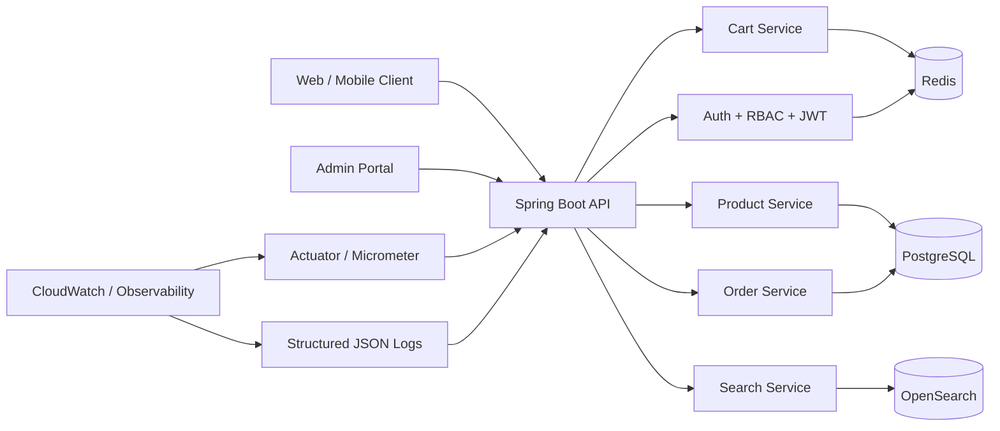

# Architecture Diagram

## Component responsibilities

- API layer: request validation, authorization, API contract, correlation IDs
- Service layer: pricing, stock checks, order lifecycle, auditing
- PostgreSQL: transactional source of truth for product, cart/order, and audit records
- Redis: session state, rate limiting, and request or catalog caching
- OpenSearch: search index for product queries and suggestions
- Observability: structured logs, metrics, health endpoints, and alerting dashboards

## Data flow

1. Client sends a request to the API.
2. Security filters validate JWT state, rate limiting, and role boundaries.
3. Service layer enforces business rules and uses PostgreSQL transactions when necessary.
4. Search-centric operations write to or read from OpenSearch asynchronously where applicable.
5. Metrics and logs are emitted for monitoring and alerting.
